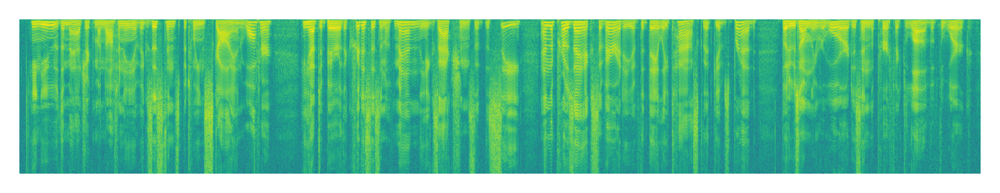
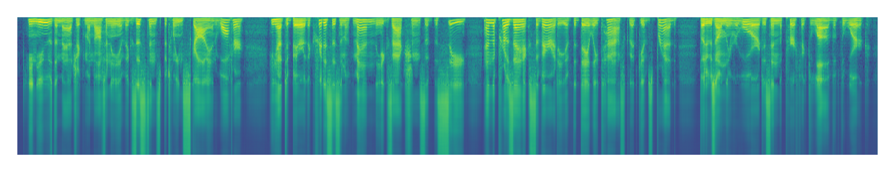
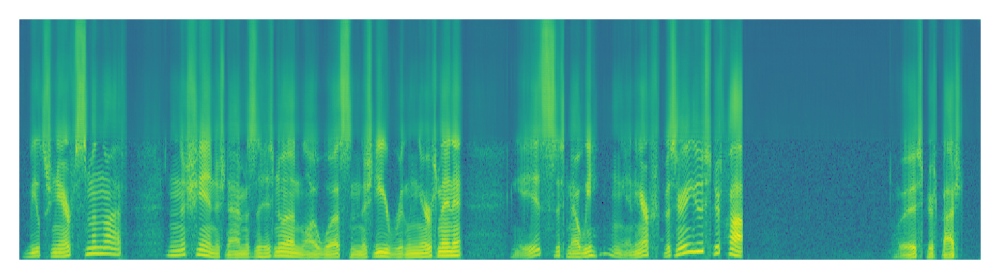
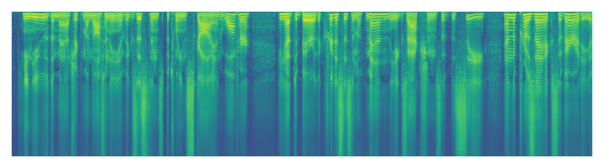
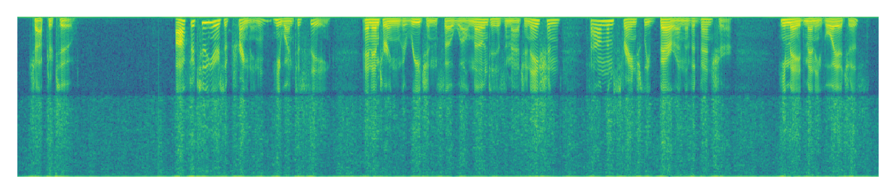
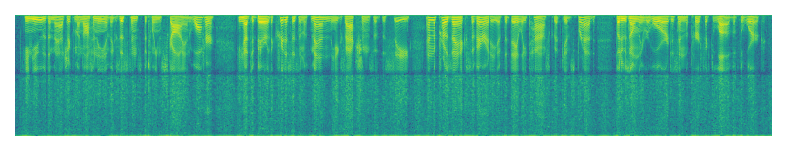
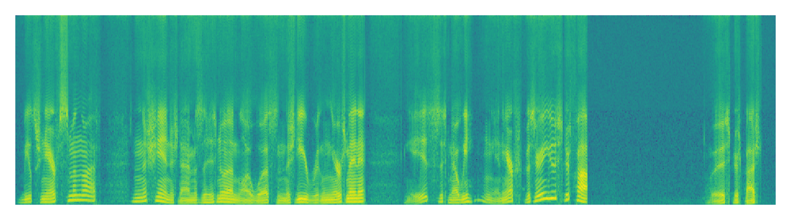
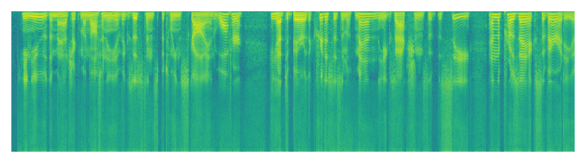

Denoising Diffusion Probabilistic Models (DDPM) have been used extensively with great success in the vision field, with many models showing particularly high-quality results in image inpainting. We propose applying similar diffusion methods to the speech domain, with the goal of performing super-resolution on speech samples. We believe that an analogous method to image inpainting can be performed on low resolution speech samples to retrieve a target high-resolution sample. Throughout this study, we compare super-resolution results from multiple baseline models with an unconditional diffusion-based approach.

## Listening samples for evaluation

We recommend using headphones for this section.

|            | 196-122150-0000                                                                          | 196-122150-0001                                                                        |
|------------|------------------------------------------------------------------------------------|------------------------------------------------------------------------------------|
|            |                                                   |                                                   |
| Input      | <audio src="new/target/196-122150-0000.wav" controls="" preload=""></audio>          | <audio src="new/lstm/196-122150-0000.wav" controls="" preload=""></audio>          |
|            |                                                   |                                                   |
| Target      | <audio src="new/target/196-122150-0000.wav" controls="" preload=""></audio>          | <audio src="new/target/196-122150-0001.wav" controls="" preload=""></audio>          |
|            |                                               |                                               |
| LSTM    | <audio src="new/lstm/196-122150-0000.wav" controls="" preload=""></audio>      | <audio src="new/lstm/196-122150-0001.wav" controls="" preload=""></audio>      |
|            |                                            |                                            |
| U-Net  | <audio src="u-net/196-122150-0000.wav" controls="" preload=""></audio>   | <audio src="new/u-net/196-122150-0001.wav" controls="" preload=""></audio>   |
|            |                                                   |                                                   |
| NU-wave2      | <audio src="new/nuwave2/196-122150-0000.wav" controls="" preload=""></audio>          | <audio src="new/nuwave2/196-122150-0001.wav" controls="" preload=""></audio>          |
|            |                                           |                                           |
| Repaint   | <audio src="new/repaint/196-122150-0000.wav" controls="" preload=""></audio>  | <audio src="new/repaint/196-122150-0001.wav" controls="" preload=""></audio>  |

