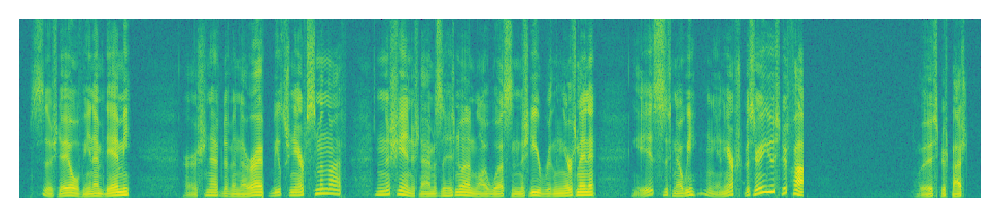
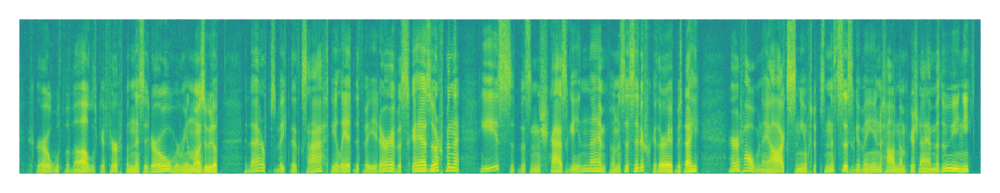
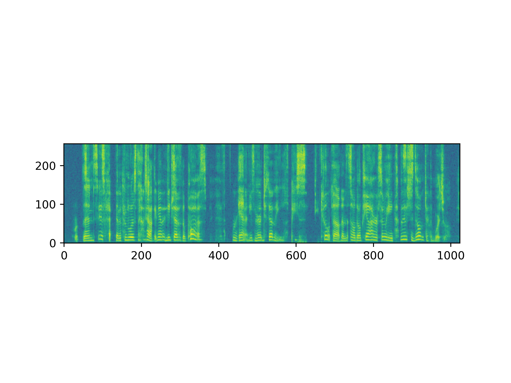

<!-- Denoising Diffusion Probabilistic Models (DDPM) have been used extensively with great success in the vision field, with many models showing particularly high-quality results in image inpainting. We propose applying similar diffusion methods to the speech domain, with the goal of performing super-resolution on speech samples. We believe that an analogous method to image inpainting can be performed on low resolution speech samples to retrieve a target high-resolution sample. Throughout this study, we compare super-resolution results from multiple baseline models with an unconditional diffusion-based approach. -->

## Listening samples for evaluation

<!-- We recommend using headphones for this section. -->

<!-- |            | 196-122150-0000                                                                          | 196-122150-0001                                                                        |
|------------|------------------------------------------------------------------------------------|------------------------------------------------------------------------------------|
|            |                                                   |                                                   |
| Input      | <audio src="new/input/196-122150-0000.wav" controls="" preload=""></audio>          | <audio src="new/input/196-122150-0001.wav" controls="" preload=""></audio>          |
|            |                                                   |                                                   |
| Target      | <audio src="new/target/196-122150-0000.wav" controls="" preload=""></audio>          | <audio src="new/target/196-122150-0001.wav" controls="" preload=""></audio>          |
|            |                                               |                                               |
| LSTM    | <audio src="new/lstm/196-122150-0000.wav" controls="" preload=""></audio>      | <audio src="new/lstm/196-122150-0001.wav" controls="" preload=""></audio>      |
|            |                                            |                                            |
| U-Net  | <audio src="new/u-net/196-122150-0000.wav" controls="" preload=""></audio>   | <audio src="new/u-net/196-122150-0001.wav" controls="" preload=""></audio>   |
|            |                                                   |                                                   |
| NU-wave2      | <audio src="new/nuwave2/196-122150-0000.wav" controls="" preload=""></audio>          | <audio src="new/nuwave2/196-122150-0001.wav" controls="" preload=""></audio>          |
|            |                                           |                                           |
| Repaint (Our model)  | <audio src="new/repaint/196-122150-0000.wav" controls="" preload=""></audio>  | <audio src="new/repaint/196-122150-0001.wav" controls="" preload=""></audio>  |

Unconditional diffusion produced plausible sounds from random noise

|            |                                                   |                                                   |
| Unconditional diffusion      | <audio src="new/Unconditional diffusion/randwave_1.wav" controls="" preload=""></audio>          | <audio src="new/Unconditional diffusion/randwave_2.wav" controls="" preload=""></audio>          | -->

What is the performance of English speech codes with English graphemes?

|    English text              |English SAC using english speech codes                                                  |Transformer TTS|
|He mentioned several {countries} | <audio src="new/Esg/He_mentioned_several_<countries>.wav" controls="" preload=""></audio> | <audio src=" " controls="" preload=""></audio>|
|He mentioned several countries |<audio src="new/Esg/He_mentioned_several_countries.wav" controls="" preload=""></audio> | <audio src="new/transformer_Esg/He_mentioned_several_countries.wav" controls="" preload=""></audio>|
|The car is movable|<audio src="new/Esg/The_car_is_movable.wav" controls="" preload=""></audio>|<audio src="new/transformer_Esg/The_car_is_movable.wav" controls="" preload=""></audio>|
|The car is {movable} | <audio src="new/Esg/The_car_is_<movable>.wav" controls="" preload=""></audio>|<audio src=" " controls="" preload=""></audio>|

What is the performance of Yorùbá speech codes and graphemes?

|    Yorùbá text              |Yorùbá SAC using Yorùbá speech codes                                                  |Transformer TTS|
|ìjọba tuntun {ti kristi} | <audio src="new/YgYsc/ìjọba_tuntun_<ti_kristi>.wav" controls="" preload=""></audio>|<audio src=" " controls="" preload=""></audio>|
|ìjọba tuntun ti kristi |<audio src="new/YgYsc/ìjọba_tuntun_ti_kristi.wav" controls="" preload=""></audio>|<audio src="new/transformer_YgYsc/ìjọba_tuntun_ti_kristi.wav" controls="" preload=""></audio>|
|àlàáfíà fún ẹ̀yin {ènìyàn} |<audio src="new/YgYsc/àlàáfíà_fún_ẹ̀yin_<ènìyàn>.wav" controls="" preload=""></audio>|<audio src=" " controls="" preload=""></audio>|
|àlàáfíà fún ẹ̀yin ènìyàn | <audio src=new/YgYsc/àlàáfíà_fún_ẹ̀yin_ènìyàn.wav" controls="" preload=""></audio>|<audio src="new/transformer_YgYsc/àlàáfíà_fún_ẹ̀yin_ènìyàn.wav" controls="" preload=""></audio>|

What is the performance of Yorùbá speech codes with English graphemes?

|    Code-switched text              |English SAC using Yorùbá speech codes                                                   |Transformer TTS|
|my {ọ̀gá} is female|<audio src="new/EgYsc/my_<ọ̀gá>_is_female.wav" controls="" preload=""></audio>|<audio src=" " controls="" preload=""></audio>|
|my ọ̀gá is female|<audio src="new/EgYsc/my_ọ̀gá_is_female.wav" controls="" preload=""></audio>|<audio src="/new/transformer_EgYsc/my_ọ̀gá_is_female.wav" controls="" preload=""></audio>|
|Pronounce it {pẹ̀lú} patience|<audio src="new/EgYsc/Pronounce_it_<pẹ̀lú>_patience.wav" controls="" preload=""></audio>|<audio src=" " controls="" preload=""></audio>|
|Pronounce it pẹ̀lú patience|<audio src="new/EgYsc/Pronounce it_pẹ̀lú_patience.wav" controls="" preload=""></audio>|<audio src="new/transformer_EgYsc/Pronounce_it_pẹ̀lú_patience.wav" controls="" preload=""></audio>|

2
What is the performance of English speech codes with Yoruba Graphemes?

|    Code-switched text              |Yorùbá SAC using English speech codes                                                   |Transformer TTS|
|ìjọba tuntun {is in town}|<audio src="new/YgEsc/ìjọba_tuntun_{is_in_town}.wav" controls="" preload=""></audio>|<audio src=" " controls="" preload=""></audio>|
|ìjọba tuntun is in town|<audio src="new/YgEsc/ìjọba_tuntun_is_in_town.wav" controls="" preload=""></audio>|<audio src="new/transformer_YgEsc/ìjọba_tuntun_is_in_town.wav" controls="" preload=""></audio>|
|ẹ̀yin ènìyàn tó {bad}|<audio src="new/YgEsc/ẹ̀yin_ènìyàn_tó_{bad}.wav" controls="" preload=""></audio>|<audio src=" " controls="" preload=""></audio>|
|ẹ̀yin ènìyàn tó bad|<audio src="new/YgEsc/ẹ̀yin_ènìyàn_tó_bad.wav" controls="" preload=""></audio>|<audio src="new/transformer_YgEsc/ẹ̀yin_ènìyàn_tó_bad.wav" controls="" preload=""></audio>|
