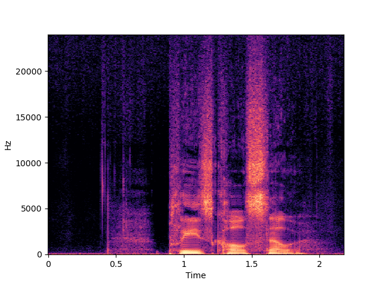

Denoising Diffusion Probabilistic Models (DDPM) have been used extensively with great success in the vision field, with many models showing particularly high-quality results in image inpainting. We propose applying similar diffusion methods to the speech domain, with the goal of performing super-resolution on speech samples. We believe that an analogous method to image inpainting can be performed on low resolution speech samples to retrieve a target high-resolution sample. Throughout this study, we compare super-resolution results from multiple baseline models with an unconditional diffusion-based approach.

## Listening samples for evaluation

### Samples: U-NET base line

We recommend using headphones for this section.

|            | p360_001                                                                           | p361_002                                                                           |
|------------|------------------------------------------------------------------------------------|------------------------------------------------------------------------------------|
|            |                                                   |                                                   |
| Input      | <audio src="new/target/196-122150-0000.wav" controls="" preload=""></audio>          | <audio src="sew/lstm/196-122150-0000.wav" controls="" preload=""></audio>          |
|            |                                               |                                               |
| Target     | <audio src="samples/origin/p360_001_mic1.wav" controls="" preload=""></audio>      | <audio src="samples/origin/p361_002_mic1.wav" controls="" preload=""></audio>      |
|            |                                            |                                            |
| NU-Wave    | <audio src="samples/x2-nuwave/p360_001_mic1.wav" controls="" preload=""></audio>   | <audio src="samples/x2-nuwave/p361_002_mic1.wav" controls="" preload=""></audio>   |
|            |                                           |                                           |
| NU-Wave+   | <audio src="samples/x2-nuwave+/p360_001_mic1.wav" controls="" preload=""></audio>  | <audio src="samples/x2-nuwave+/p361_002_mic1.wav" controls="" preload=""></audio>  |
|            |                                           |                                           |
| NU-Wave 2  | <audio src="samples/x2-nuwave2/p360_001_mic1.wav" controls="" preload=""></audio>  | <audio src="samples/x2-nuwave2/p361_002_mic1.wav" controls="" preload=""></audio>  |
|            |                                          |                                          |
| NU-Wave 2+ | <audio src="samples/x2-nuwave2+/p360_001_mic1.wav" controls="" preload=""></audio> | <audio src="samples/x2-nuwave2+/p361_002_mic1.wav" controls="" preload=""></audio> |
|            |                                           |                                           |
| WSRGlow    | <audio src="samples/x2-wsrglow/p360_001_mic1.wav" controls="" preload=""></audio>  | <audio src="samples/x2-wsrglow/p361_002_mic1.wav" controls="" preload=""></audio>  |
|            |                                               |                                               |
| UDM+       | <audio src="samples/x2-mcg/p360_001_mic1.wav" controls="" preload=""></audio>      | <audio src="samples/x2-mcg/p361_002_mic1.wav" controls="" preload=""></audio>      |
